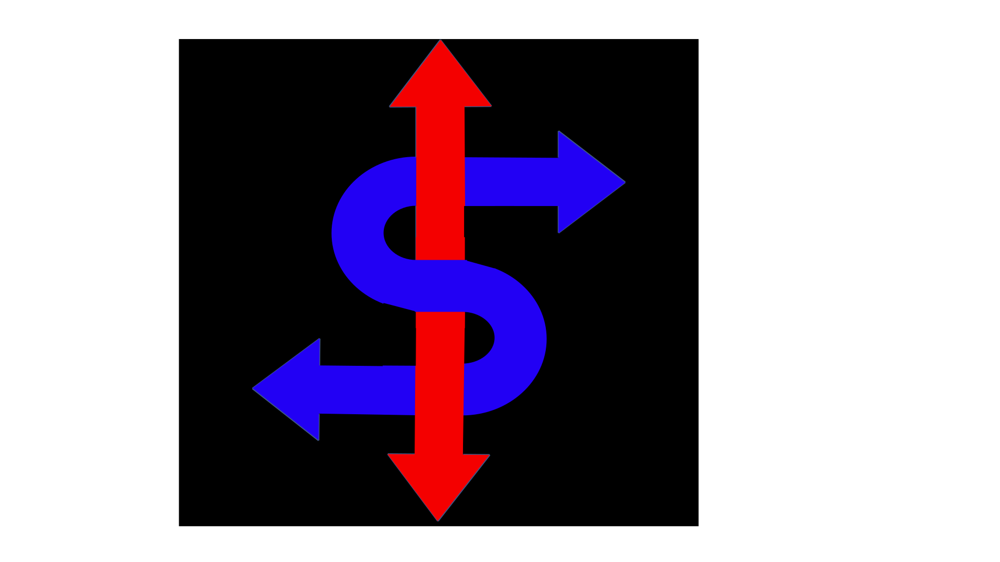

## Hi there 👋 

These are some of my personal projects! 
I have 3.5 projects currently available. 
and will update regularly. 

All projects on this GitHub are my own work. 

- AMU firmware (and probe firmware) 

- AMU rotation calculator tool 

- a dump of some of my non-proprietary and semi useful 3d designs

 Thanks for stopping by!!
 🙌
